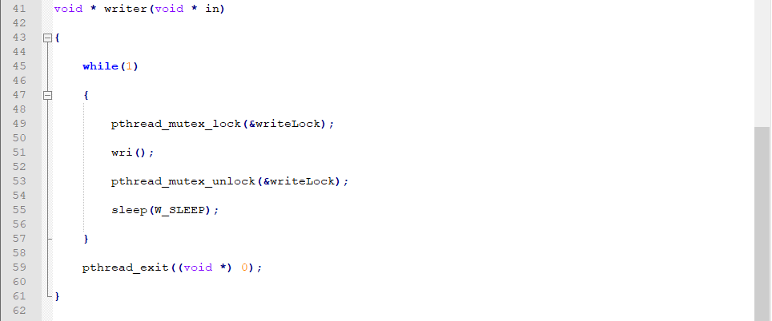
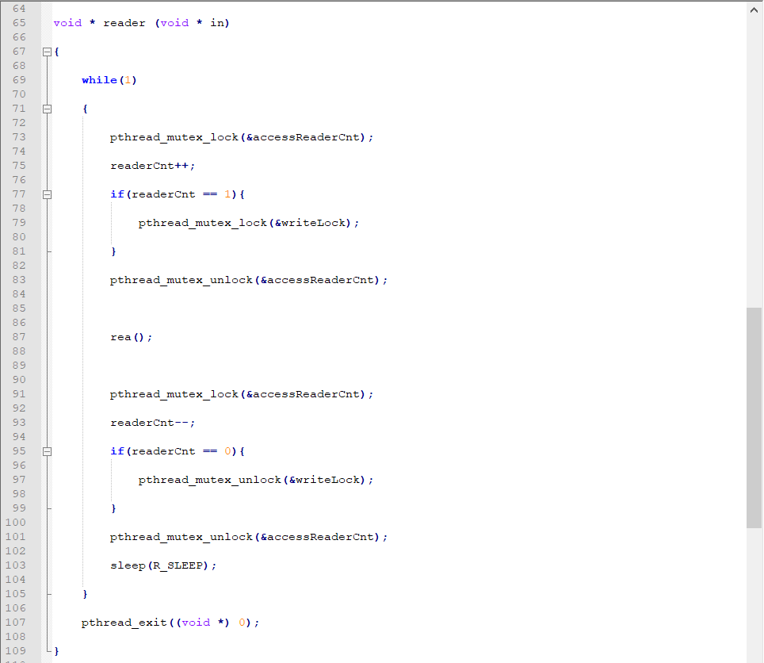
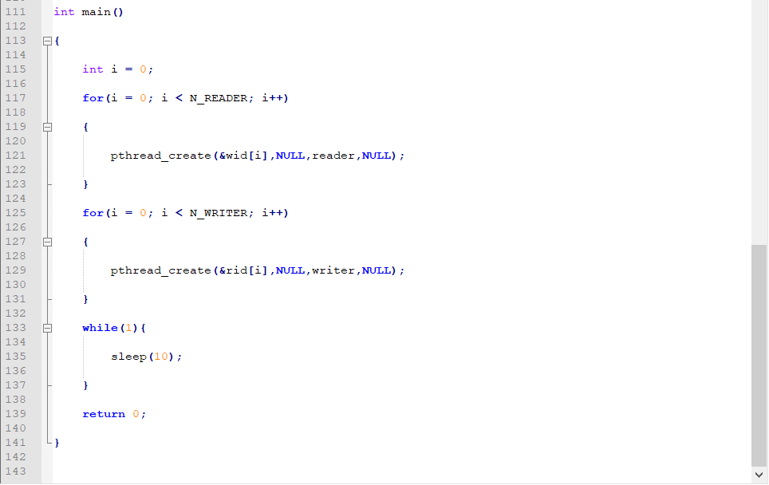
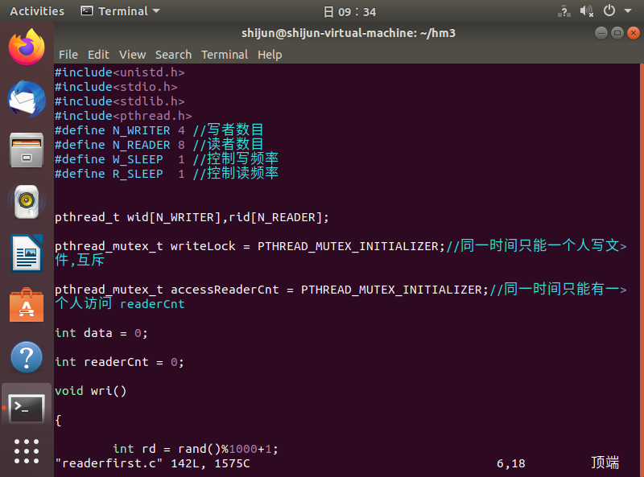
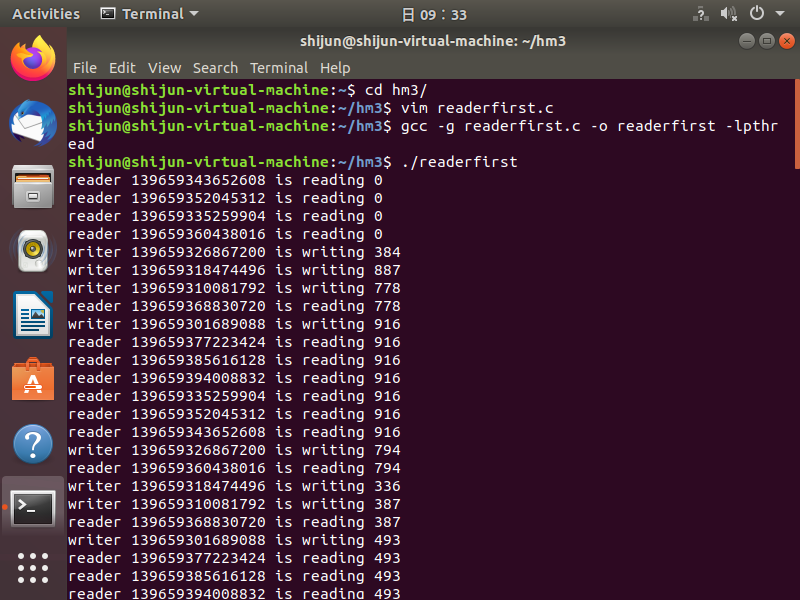
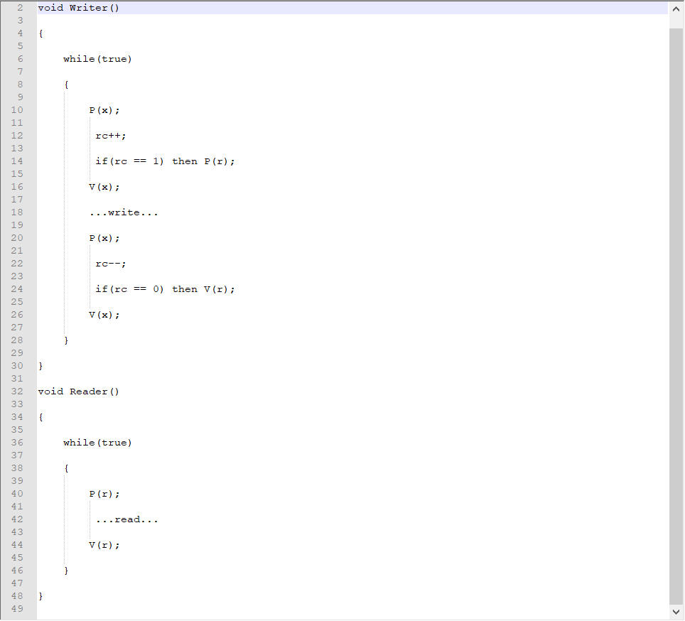
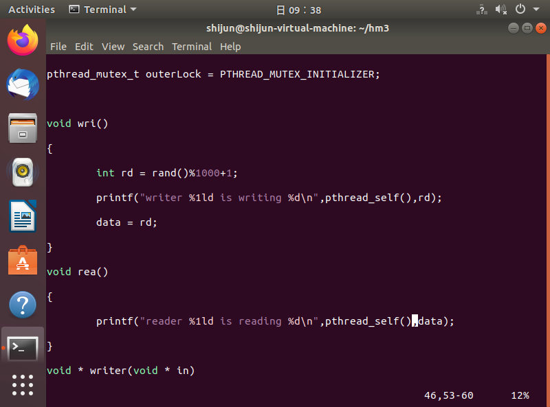
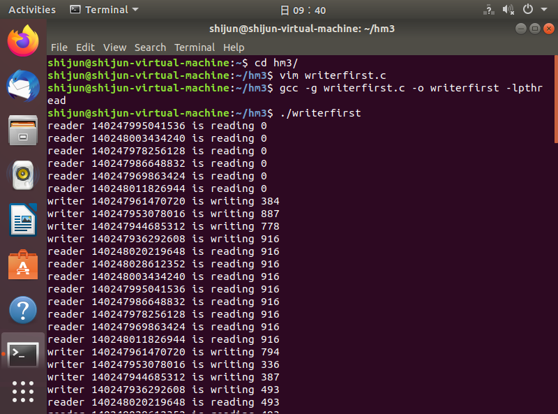

# Linux-Course-Sonorous
# 实验题目：lab3:多线程编程 #
小组名称：内里没有核

小组成员：颜宇辰，史杰，林鹏

## 一、实验目的 ##
1.掌握基于pthread线程库的多线程编程技术；

2掌握基本的线程间同步技术(sem，mutex)；

3理解共享资源并掌握其操作方法。

## 二、实验内容 ##
读者-写者问题多线程实现

1一个数据集（如数据、文件等）被N个线程读写；

2一些线程只要求读数据集内容，称为读者 (Reader)，实验读者数
不少于6个；

3另些线程要求修改数据集内容，称为写者 (Writer)，实验写者数
不少于3个；

4多个读者可以同时读数据集内容，不需要互斥操作；

5一个写者不能和其他写者或读者同时访问数据集，换句话说，写
者和其他写者或读者之间必须互斥操作；

6读者优先：如果有读者，写者需要等待！用于更新不频繁或更新
影响不显著、读者较多的场合；

7写者优先：如果有写者，读者需要等待！用于更新频繁或更新影
响显著的场合。

## 三、实验过程与结果 ##
1.读者优先
（1）只要有一个读者在读，后续读者可读，写者需要等待全部读者结束才能访问数据，也就是无读者、写者，新读者可以读；无写者等待，但有其他读者正在读，新读者可以读；有写者等待，但有其他读者正在读，新读者可以读；有写者写，新读者等，这样来说可能会导致写者饥饿

读者优先伪码如下，其中信号量w控制对访问共享对象的临界区的访问。信号量mutex保护对共享变量readercnt的访问，readercnt统计当前在临界区中的读者数量。每当一个写者进入临界区时，它对互斥锁w加锁，每当它离开临界区是，对w解锁。这就保证了任何时候只有一个写者。另一方面，只有第一个进入临界区的读者对w加锁，而只有最后一个进入离开临界区的读者对w解锁。这就意味着还有一个读者占用互斥锁w，无限多数量的读者可以没有障碍地进入临界区。

上图的代码如果有读者不断的到来，写者就可能无限的等待。该算法给予了读者较高的优先级，但是从某种意义上来说，该种优先级是很弱的，因为一个离开临界区的写者可能重启一个等待的写者，而不是一个在等待的读者。想象一个场景：一群写者使一个读者饥饿。

（2）定义读写者数量和读写频率

（3）使用互斥量，实现线程间对数据的互斥访问，定义数据初始值为0，使用互斥锁来确保同一时间只能一个进程写文件，实现互斥。使用信号量来实现访问资源的同步，当任何读者想读时，写者都必须被阻塞

（4）定义读写动作，使用rand()向数据集写入0-1000随机数并输出显示，用pthread_self()得到对应线程号

（5）定义写函数，读者阻塞了写者并停止阻塞之前，后续的任何读者优先执行

（6）定义读函数，任何读者想读时，写者都会被阻塞，后续任何读者都会优于写者执行，使用readerCnt统计读者数量，使用互斥量accessReaderCnt来互斥各线程对于readerCnt的访问

（7）main函数执行随机线程读写

 (8)运行结果

2写者优先（类似与读者优先，简要叙述）

（1）只要有一个写者在读，后续写者可写，即无读者、写者，新读者可以读；无写者等待，但有其他读者正在读，新读者可以读；有写者等待，但有其他读者正在读，新读者等；有写者写，新读者等读者需要等待全部写者结束才能访问数据。写者优先与读者优先的不同是：如果读者来，有写者等待，但有其他读者正在读，新读者等。使用两个互斥锁和两个信号量来确保访问资源的互斥和同步

写者优先伪码如下

（2）部分程序截图

（3）运行结果

## 四、实验总结 ##
1.实验总结收获

学习了使用pthread线程库的调用和互斥锁，在实验过程中不断改错调整，通过上课所学和在网上查找资料，学习了使用互斥锁保证对文件的单个进程操作，以及用信号量实现同步访问资源。以读者优先为例，4个写者，8个读者，使用互斥锁来确保同一时间只能一个进程写文件，实现互斥。使用信号量来实现访问资源的同步。当任何读者想读时，写者都必须被阻塞，处于饥饿状态，并且，读者阻塞了写者并停止阻塞之前，后续的任何写者都会读者优先于执行。这就如同有一个读者队列，当第一个读者入队时，写者完全被阻塞，直到最后一个读者离开队列。用pthread_self()函数得到线程Id等，熟悉了基本的多线程编程技术，掌握了基本的线程间同步技术，也更加熟悉了linux系统的编译操作。

2.遇到的问题

按照之前的编译命令 gcc **.c -o **编译遇到报错undefined reference to 'pthread_create'

原因： pthread 库不是 Linux 系统默认的库，连接时需要使用静态库 libpthread.a，在编译命令中要加 -lpthread参数

3未解决问题
在读者优先情况下，如果有读者不断的到来，写者就可能无限的等待。该算法给予了读者较高的优先级，但是从某种意义上来说，该种优先级是很弱的，因为一个离开临界区的写者可能重启一个等待的写者，而不是一个在等待的读者，该如何解决这种饥饿问题。
## 五、实验源码 ##
见文件夹lab3soursecode